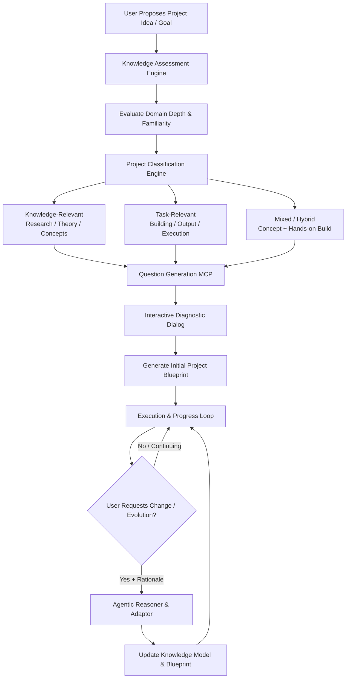

# Agentic AI Workflow: Adaptive Project Design & Evolution System

## Executive Overview

This document outlines the architecture and workflow for an **Agentic AI Project Design System**. Rather than handing users a rigid template or static project plan, this system dynamically designs, structures, and continuously adapts a project based on the user's specific domain knowledge, intent, and evolving preferences.

The core philosophy is:
> **Evaluate knowledge → Classify intent → Interactively generate blueprint → Empower continuous user-steered evolution through agentic dialog.**

---

## Key System Objectives

1. **Adaptive Baseline**: Assess the user's current depth of knowledge in the target subject before generating project scope.
2. **Multi-Dimensional Project Classification**: Categorize the project intent as **Knowledge-Relevant**, **Task-Relevant**, or **Mixed (Hybrid)**.
3. **Interactive Questioning via MCP**: Use Model Context Protocol (MCP) tooling to generate targeted diagnostic questions that extract intent, constraints, and implicit preferences.
4. **Dynamic Project Blueprint Generation**: Produce a customized, structured project blueprint (milestones, deliverables, conceptual checkpoints, resource requirements).
5. **Continuous User Freedom & Evolution**: Allow the user to modify, fork, or evolve the blueprint at any point. When users request updates with their rationale/reasoning, the agentic workflow re-evaluates the project graph while preserving past progress.
6. **Agentic Communication**: Maintain an active, reflective dialogue loop that aligns project goals with user learning styles and working patterns.

---

## System Architecture & Workflow



---

## Core Components Breakdown

### 1. Knowledge Evaluation Engine
Before suggesting a project, the system performs a non-intrusive knowledge evaluation:
- **Baseline Probe**: Analyzes user background, prior project experience, and technical/conceptual comfort level.
- **Scaffolding Determination**: Determines whether the project requires heavy explanatory scaffolding (beginner), targeted guidance (intermediate), or pure peer-level architectural execution (advanced).

---

### 2. Project Classification Engine
Projects are classified into three primary archetypes:

| Archetype | Primary Focus | Key Deliverables | Example Scenarios |
| :--- | :--- | :--- | :--- |
| **Knowledge-Relevant** | Conceptual mastery, deep domain understanding, research | Literature reviews, synthesize docs, comparative analysis, mental models | "Understand how transformer attention mechanisms work from first principles" |
| **Task-Relevant** | Execution, building tangible artifacts, pragmatic outcomes | Codebases, deployed services, physical specs, step-by-step builds | "Build an automated web scraper and store results in PostgreSQL" |
| **Mixed (Hybrid)** | Dual focus: understanding theory while producing a real-world project | Working prototypes accompanied by explanatory documentation | "Build a RAG pipeline from scratch while mastering vector indexing algorithms" |

---

### 3. Question Generation MCP (Model Context Protocol)

The system leverages a specialized **Question Generation MCP Tool / Server** to interactively uncover project parameters:

- **Dynamic Questioning**: Generates 3–5 high-signal, non-generic questions based on initial assessment.
- **Preference Discovery**: Asks about preferred pace, tooling, output format, risk tolerance, and learning vs. building ratio.
- **Blueprint Drafting**: Aggregates response payload to compile the **Master Project Blueprint**.

#### Example MCP Specification (`generate_project_questions`)
```json
{
  "tool": "generate_project_questions",
  "description": "Generates diagnostic questions to define project blueprint based on user knowledge profile and domain",
  "parameters": {
    "domain": "Machine Learning",
    "user_knowledge_level": "Intermediate",
    "project_archetype": "Mixed",
    "user_stated_goal": "Create a custom agentic workflow engine"
  }
}
```

---

### 4. Interactive Blueprint Generation

The output of the MCP evaluation is a structured, human-readable **Project Blueprint**:

- **Phase Breakdown**: Phased milestones tailored to user knowledge gaps.
- **Knowledge Checkpoints**: Conceptual milestones to ensure understanding before proceeding.
- **Task Deliverables**: Specific, testable artifacts to build.
- **Adaptability Metadata**: Hooks where the blueprint can be expanded or modified.

---

### 5. Continuous Evolution & User Freedom

The user is never locked into the initial plan. The system provides explicit freedom for the user to steer or pivot the project at any stage.

#### Evolutionary Protocol:
1. **User Request**: User proposes a scope change, tool swap, concept drill-down, or goal shift.
2. **User Rationale**: User provides reasoning for the change (e.g., *"I want to switch from REST to GraphQL because our frontend needs flexible querying"* or *"I am struggling with vector embeddings, let's pause building and spend 2 days on theory"*).
3. **Agentic Re-planning**:
   - The AI evaluates the user's rationale.
   - Adjusts the active dependency graph without discarding completed work.
   - Regenerates the updated blueprint with transparent change logs explaining the impact on timelines and prerequisites.

---

### 6. Agentic Communication Model

Communication is grounded in peer-to-peer agentic collaboration:

- **Active Alignment**: The agent proactively checks if the current pace and depth match user expectations.
- **Reasoning Validation**: When users suggest changes, the agent engages in constructive dialogue, validating reasoning or suggesting optimizations.
- **Cognitive Load Optimization**: Keeps user focus on high-leverage decisions while handling context tracking and blueprint maintenance automatically.

---

## Detailed Step-by-Step Execution Lifecycle

```
[Phase 1: Discovery & Probe]
  │ ──► User provides goal statement
  │ ──► AI runs domain assessment probe
  │
[Phase 2: Classification & MCP Questioning]
  │ ──► Classify into (Knowledge | Task | Hybrid)
  │ ──► MCP tool triggers dynamic question suite
  │ ──► User answers diagnostic questions
  │
[Phase 3: Blueprint Generation]
  │ ──► Generate interactive Markdown Blueprint
  │ ──► User reviews, adjusts, and approves initial plan
  │
[Phase 4: Adaptive Execution Loop]
  │ ──► Step-by-step task/concept delivery
  │ ──► Continuous knowledge tracking & check-ins
  │
[Phase 5: User-Driven Evolution]
  │ ──► User submits change request with rationale
  │ ──► AI updates blueprint & knowledge graph
  │ ──► Resume execution seamlessly
```

---

## Summary & Next Steps

This workflow transforms project creation from static execution into an **evolving, collaborative partnership**. By combining automated classification, MCP question generation, and agentic communication, the system guarantees that projects remain tailored, educational, and responsive to user intent at all times.
