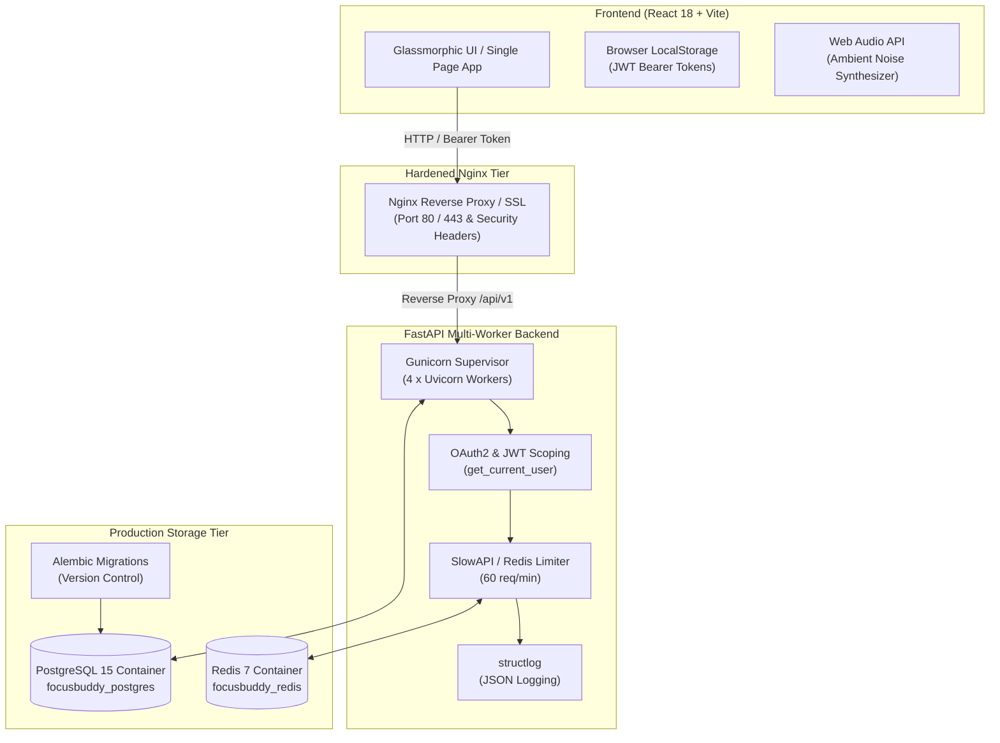

# Immersed (FocusBuddy) 🧠✨
### The ADHD-Friendly AI Teaching Assistant & Study Companion

[](https://fastapi.tiangolo.com/)
[](https://react.dev/)
[](https://vitejs.dev/)
[](https://www.docker.com/)
[](LICENSE)

**Immersed (FocusBuddy)** is a specialized, glassmorphic conversational dashboard designed to help students—especially those with ADHD—study, focus, and learn without feeling overwhelmed. By chunking complex explanations, rewarding focus gamification, and blocking auditory distractions, FocusBuddy turns study sessions into structured, engaging steps.

---

## 🏗️ Architecture Overview



---

## 🚀 Key Features

### 1. ADHD-Optimized Conversational Feed
* **Scannable Chunking**: Responses from the AI are automatically reformatted into short paragraphs, with key concepts and terminology bolded or highlighted to enable quick reading and visual anchoring.
* **Clickable Follow-up Options**: Action suggestions (e.g., *Continue*, *Show an example*, *Quiz me*, *Draw a diagram*) are parsed dynamically and rendered as interactive buttons under messages to maintain momentum.
* **Faint Horizontal Dividers & Glassmorphic Tables**: Long text blocks are separated by clean, minimal dividers and visual tables for high-contrast, structured readability.

### 2. Gamified Pomodoro Focus Timer
* A circular countdown timer built into the right sidebar.
* **Plant Evolution Stages**: As focus intervals progress, a virtual seed evolves to reward focus sessions (`🌱` $\rightarrow$ `🌿` $\rightarrow$ `🪴` $\rightarrow$ `🌳` $\rightarrow$ `🌸` bloomed!).
* Emits a soft, browser-synthesized notification chime when the focus block completes.

### 3. Persistent Local Task Planner
* A study checklist allowing students to partition larger goals into smaller, bite-sized tasks.
* Saved locally via browser `localStorage` to ensure persistence across page refreshes.

### 4. Ambient Rainfall Synthesizer
* Built using the browser's native **Web Audio API**.
* Synthesizes waterfall/rainfall frequencies dynamically in real-time (using mathematical brown noise formulas) directly in the browser. 
* Operates entirely offline with **zero network dependencies** and zero media bandwidth usage.

### 5. Mindful Breathing Mascot Bubble
* Integrates a guided breathing widget (`Inhale` $\rightarrow$ `Hold` $\rightarrow$ `Exhale`) synced to a smooth Mascot bubble scaling animation to help center focus and lower testing anxiety.

### 6. Collapsible Double-Sidebar Layout
* Collapses sidebars smoothly via CSS Transitions to maximize visual space.
* **Focus Mode / DND Mode**: Collapses all panels in a single click, allowing students to focus solely on the active learning feed.

---

## ⚡ Enterprise Production Architecture (5 Production Phases)

### 7. Multi-Tenancy & User Authentication (Phase 2)
* **JWT & OAuth2 Authentication**: Secure registration and login (`/api/v1/auth`) with 7-day JWT access tokens.
* **Direct Bcrypt Password Hashing**: Cryptographic password hashing ensuring no plaintext passwords are stored.
* **User-Scoped Multi-Tenancy**: Scopes sessions, projects, knowledge base cards, and tasks to authenticated user accounts.

### 8. Process Scaling & Abuse Protection (Phase 3)
* **Gunicorn Multi-Worker Supervisor**: 4 Uvicorn worker processes utilizing all CPU cores with automatic worker crash recovery.
* **Redis Rate Limiting**: `slowapi` rate limiting (60 requests/minute) backed by containerized `redis:7-alpine`.

### 9. Persistent Feature APIs (Phase 4)
* **Projects & Blueprints API**: `/api/v1/projects` endpoints for study goals and blueprint JSON generation.
* **Knowledge Base Cards API**: `/api/v1/knowledge` endpoints for saving, tagging, and tracking card mastery scores.
* **Study Tasks API**: `/api/v1/tasks` endpoints for cross-device checklist synchronization.

### 10. Web Tier Hardening & Observability (Phase 5)
* **Hardened Nginx Reverse Proxy**: Custom `nginx.conf` injecting strict security headers (`CSP`, `HSTS`, `X-Frame-Options DENY`) and Gzip level 6 compression.
* **Structured JSON Logging**: `structlog` outputting ISO timestamped JSON logs for cloud aggregation.
* **Health Probes**: K8s/Cloud-native liveness (`/health/live`) and readiness (`/health/ready`) probes.


---

## 🔒 Security & Privacy Model

* **JWT Bearer Authentication**: Auth headers (`Authorization: Bearer <token>`) validate user identity across API routes.
* **Header-Based LLM Key Overrides**: Custom LLM API keys (`OpenAI`, `OpenRouter`, `Groq`, `Anthropic`) are passed per-request via headers (`X-OpenAI-Key`) and never stored on disk.
* **SQL Injection & Rate Limit Protection**: SQLAlchemy 2.0 parameterized queries and Redis request counters protect against DDoS spikes.

---

## 🛠️ Technology Stack

| Layer | Technologies Used |
| :--- | :--- |
| **Frontend** | React 18, Vite ESM, Vanilla CSS3 (Glassmorphism Design System), Lucide Icons |
| **Backend** | Python 3.10+, FastAPI, AsyncIO, Pydantic v2, SQLAlchemy 2.0, Gunicorn, Uvicorn |
| **Authentication** | JWT (`python-jose`), Direct `bcrypt` password hashing, FastAPI `OAuth2PasswordBearer` |
| **Database & Cache** | PostgreSQL 15 (`asyncpg`, `psycopg2`), Redis 7, Alembic migrations |
| **Web & Security** | Nginx Reverse Proxy, `slowapi` rate limiting, `structlog` JSON logging |
| **LLM Support** | Mock GPT, OpenAI API, OpenRouter API, Groq LPU, Anthropic API |
| **DevOps & Infrastructure** | Docker, Docker Compose, Nginx, Pytest |

---

## 💻 Quick Start & Installation

### Option A: Running via Docker Compose (Recommended)

1. Clone the repository:
   ```bash
   git clone https://github.com/sagarsambhwani/Immersed.git
   cd Immersed
   ```
2. Launch full production stack (Nginx, Gunicorn, PostgreSQL, Redis):
   ```bash
   docker-compose up --build
   ```
3. Access the application:
   * **Nginx Web Application**: [http://localhost](http://localhost)
   * **Backend API Docs (Swagger UI)**: [http://localhost:8000/docs](http://localhost:8000/docs)

---

### Option B: Local Development Setup

#### Prerequisites
* **Python 3.10+**
* **Node.js v18+**

#### 1. Start the Backend Server
```bash
cd backend

# Create & activate virtual environment
python -m venv .venv

# On Windows:
.\.venv\Scripts\activate
# On macOS/Linux:
source .venv/bin/activate

# Install dependencies
pip install -r requirements.txt

# Run database migrations
alembic upgrade head

# Launch FastAPI development server
python -m pytest
uvicorn app.main:app --host 127.0.0.1 --port 8000 --reload
```

#### 2. Start the Frontend Server
```bash
cd frontend

# Install dependencies
npm install

# Run Vite dev server
npm run dev
```

Open **[http://localhost:5173](http://localhost:5173)** in your browser!

---

## 🧪 Testing

Execute full automated unit, security, and endpoint integration test suite:

```bash
cd backend
.\.venv\Scripts\python -m pytest
```

---

## 📖 Architecture & Systems Documentation

To view detailed architectural notes, FAQs, design patterns, and error logs, visit:
- 📖 [SYSTEM_ARCHITECTURE_NOTES.md](SYSTEM_ARCHITECTURE_NOTES.md) — Comprehensive technical notes & FAQ
- 🗺️ [ROADMAP.md](ROADMAP.md) — 5-Phase Production Readiness Roadmap


---

## 🌿 Environment Promotion Workflow

This project enforces a strict **3-Stage Promotion Workflow**:

1. **Development (`development`)**: Feature development and local testing.
2. **Staging (`staging`)**: Pre-release verification and user testing.
3. **Production (`main`)**: Battle-tested release branch.

---

## 📄 License

Distributed under the MIT License. See `LICENSE` for more information.
