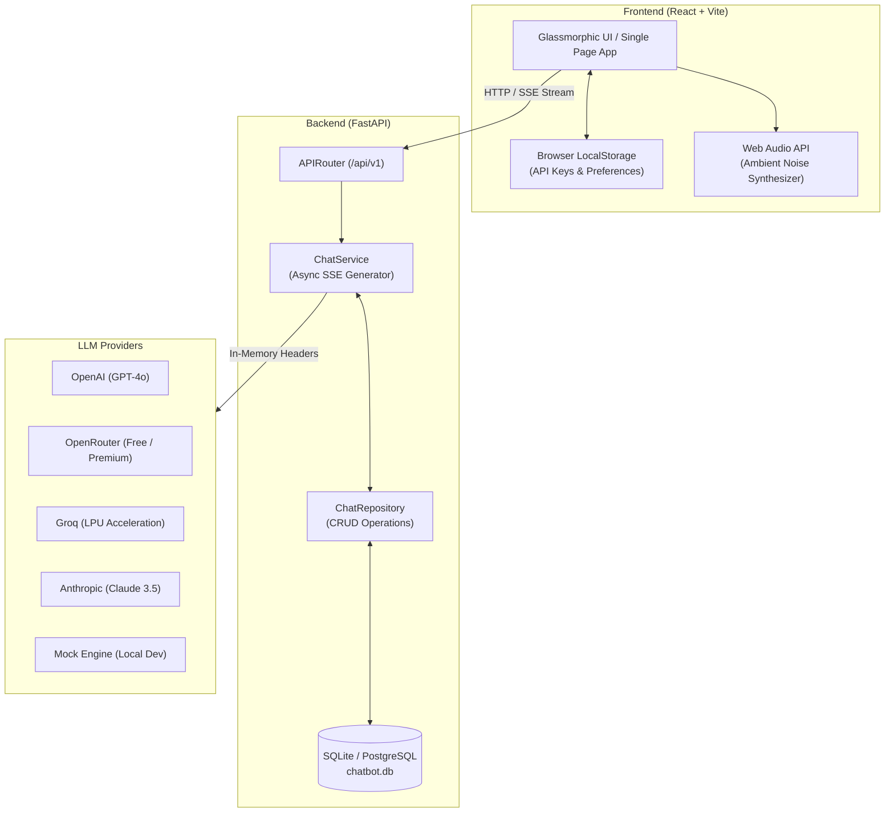

# Immersed (FocusBuddy) 🧠✨
### The ADHD-Friendly AI Teaching Assistant & Study Companion

[](https://fastapi.tiangolo.com/)
[](https://react.dev/)
[](https://vitejs.dev/)
[](https://www.docker.com/)
[](LICENSE)

**Immersed (FocusBuddy)** is a specialized, glassmorphic conversational dashboard designed to help students—especially those with ADHD—study, focus, and learn without feeling overwhelmed. By chunking complex explanations, rewarding focus gamification, and blocking auditory distractions, FocusBuddy turns study sessions into structured, engaging steps.

---

## 🏗️ Architecture Overview



---

## 🚀 Key Features

### 1. ADHD-Optimized Conversational Feed
* **Scannable Chunking**: Responses from the AI are automatically reformatted into short paragraphs, with key concepts and terminology bolded or highlighted to enable quick reading and visual anchoring.
* **Clickable Follow-up Options**: Action suggestions (e.g., *Continue*, *Show an example*, *Quiz me*, *Draw a diagram*) are parsed dynamically and rendered as interactive buttons under messages to maintain momentum.
* **Faint Horizontal Dividers & Glassmorphic Tables**: Long text blocks are separated by clean, minimal dividers and visual tables for high-contrast, structured readability.

### 2. Gamified Pomodoro Focus Timer
* A circular countdown timer built into the right sidebar.
* **Plant Evolution Stages**: As focus intervals progress, a virtual seed evolves to reward focus sessions (`🌱` $\rightarrow$ `🌿` $\rightarrow$ `🪴` $\rightarrow$ `🌳` $\rightarrow$ `🌸` bloomed!).
* Emits a soft, browser-synthesized notification chime when the focus block completes.

### 3. Persistent Local Task Planner
* A study checklist allowing students to partition larger goals into smaller, bite-sized tasks.
* Saved locally via browser `localStorage` to ensure persistence across page refreshes.

### 4. Ambient Rainfall Synthesizer
* Built using the browser's native **Web Audio API**.
* Synthesizes waterfall/rainfall frequencies dynamically in real-time (using mathematical brown noise formulas) directly in the browser. 
* Operates entirely offline with **zero network dependencies** and zero media bandwidth usage.

### 5. Mindful Breathing Mascot Bubble
* Integrates a guided breathing widget (`Inhale` $\rightarrow$ `Hold` $\rightarrow$ `Exhale`) synced to a smooth Mascot bubble scaling animation to help center focus and lower testing anxiety.

### 6. Collapsible Double-Sidebar Layout
* Collapses sidebars smoothly via CSS Transitions to maximize visual space.
* **Focus Mode / DND Mode**: Collapses all panels in a single click, allowing students to focus solely on the active learning feed.

---

## 🔒 Security & Privacy Model

* **Zero-Storage Client API Keys**: User-provided LLM API keys (`OpenAI`, `OpenRouter`, `Groq`, `Anthropic`) are **never written to the server database or environment logs**.
* **Header-Based Overrides**: Keys are stored locally in the browser's `localStorage` and passed per-request via custom HTTP headers (`X-OpenAI-Key`, `X-OpenRouter-Key`, `X-Groq-Key`, `X-Anthropic-Key`).
* **SQL Injection & CORS Protection**: Built with SQLAlchemy 2.0 parameterized queries and strict CORS origin limits (`CORS_ORIGINS`).

---

## 🛠️ Technology Stack

| Layer | Technologies Used |
| :--- | :--- |
| **Frontend** | React 18, Vite ESM, Vanilla CSS3 (Custom Glassmorphism Design System), Lucide Icons |
| **Backend** | Python 3.10+, FastAPI, AsyncIO, Pydantic v2, SQLAlchemy 2.0, aiosqlite |
| **LLM Support** | Mock GPT, OpenAI API, OpenRouter API, Groq LPU, Anthropic API |
| **DevOps** | Docker, Docker Compose, Nginx, Pytest |

---

## 💻 Quick Start & Installation

### Option A: Running via Docker Compose (Recommended)

1. Clone the repository:
   ```bash
   git clone https://github.com/sagarsambhwani/Immersed.git
   cd Immersed
   ```
2. Launch the services:
   ```bash
   docker-compose up --build
   ```
3. Access the application:
   * **Frontend Application**: [http://localhost:3000](http://localhost:3000)
   * **Backend API Docs (Swagger UI)**: [http://localhost:8000/docs](http://localhost:8000/docs)

---

### Option B: Local Development Setup

#### Prerequisites
* **Python 3.10+**
* **Node.js v18+**

#### 1. Start the Backend Server
```bash
cd backend

# Create & activate virtual environment
python -m venv .venv

# On Windows:
.venv\Scripts\activate
# On macOS/Linux:
source .venv/bin/activate

# Install dependencies
pip install -r requirements.txt

# Launch FastAPI development server
uvicorn app.main:app --host 127.0.0.1 --port 8000 --reload
```

#### 2. Start the Frontend Server
```bash
cd frontend

# Install dependencies
npm install

# Run Vite dev server
npm run dev
```

Open **[http://localhost:5173](http://localhost:5173)** in your browser!

---

## 🧪 Testing

Execute automated unit and endpoint integration tests:

```bash
cd backend
.venv\Scripts\python -m pytest
```

---

## 🗺️ Production Roadmap

To view our step-by-step technical plan for enterprise deployment (PostgreSQL migration, JWT multi-tenancy, Gunicorn process scaling, Redis rate limiting), check out [ROADMAP.md](ROADMAP.md).

---

## 🌿 Environment Promotion Workflow

This project enforces a strict **3-Stage Promotion Workflow**:

1. **Development (`development`)**: Feature development and local testing.
2. **Staging (`staging`)**: Pre-release verification and user testing.
3. **Production (`main`)**: Battle-tested release branch.

---

## 📄 License

Distributed under the MIT License. See `LICENSE` for more information.
