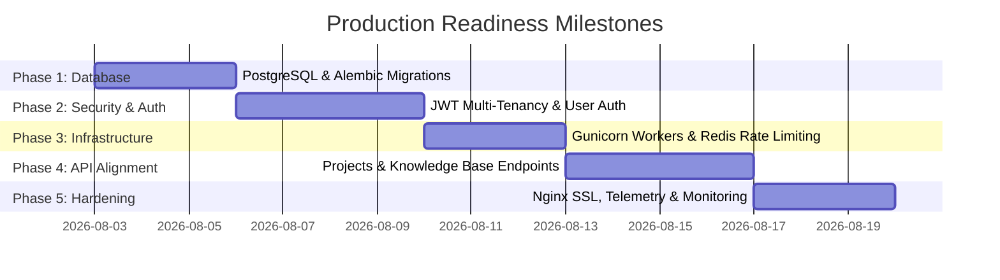

# 🚀 Enterprise Production Readiness Roadmap

This roadmap outlines the step-by-step micro-agile plan to transition the **FocusBuddy / Immersed Chatbot** from MVP to an enterprise-grade, high-throughput production platform.

---

## 📅 Roadmap Overview

---

## ⚙️ Phase Breakdown & Deliverables

### Phase 1: High-Performance Database Migration (SQLite ➔ PostgreSQL)
> **Objective**: Eliminate database file locks and enable high-concurrency database connection pooling.

- [x] **Dependencies**: Add `psycopg2-binary`, `asyncpg`, and `alembic` to `backend/requirements.txt`.
- [x] **Docker Compose**: Add a dedicated `postgres:15-alpine` container with volume persistence.
- [x] **Database Connection**: Update `backend/app/config.py` and `backend/app/db/session.py` to support `postgresql+asyncpg://`.
- [x] **Migrations**: Initialize Alembic migration scripts to track schema evolution safely.
- [x] **Verification**: Run pytest suite against PostgreSQL instance.

---

### Phase 2: User Authentication & Multi-Tenancy (JWT / OAuth2)
> **Objective**: Protect user sessions and isolate chat histories per user account.

- [x] **Data Model**: Add `users` table and `user_id` foreign key column to `chat_sessions` table.
- [x] **Auth Module**: Create `backend/app/api/v1/endpoints/auth.py` with `/register`, `/login`, and `/token` endpoints using `python-jose` and `bcrypt`.
- [x] **Multi-Tenant Scoping**: Filter `ChatRepository` methods (`get_sessions`, `get_session`, `create_session`) by authenticated `user_id`.
- [ ] **Frontend Integration**: Implement Auth Modal / Token Interceptor in `frontend/src/services/api.js`.

---

### Phase 3: Process Management & Abuse Protection
> **Objective**: Scale CPU core usage and protect downstream LLM API keys from DDoS or billing spikes.

- [x] **Gunicorn Multi-Worker**: Update `backend/Dockerfile` to run `gunicorn app.main:app -w 4 -k uvicorn.workers.UvicornWorker`.
- [x] **Rate Limiting**: Integrate `slowapi` / Redis middleware to enforce rate limits (e.g., 60 requests/minute per client).
- [x] **Redis Container**: Add `redis:7-alpine` service to `docker-compose.yml`.
- [x] **Verification**: Run backend pytest suite with rate limiting middleware enabled.

---

### Phase 4: Backend API Alignment for Frontend Features
> **Objective**: Provide persistent database storage for currently mocked UI tabs.

- [x] **Projects API**: Implement `/api/v1/projects` endpoints + `Project` model in backend.
- [x] **Knowledge Base API**: Implement `/api/v1/knowledge` endpoints for saving notes, summaries, and tags.
- [x] **Tasks & Focus Timer API**: Implement `/api/v1/tasks` endpoints for cross-device task sync.

---

### Phase 5: Nginx Hardening, TLS & Observability
> **Objective**: Hardened web tier, TLS encryption, structured logging, and health monitoring.

- [ ] **Nginx Config**: Create custom `nginx.conf` with security headers (`CSP`, `X-Frame-Options`, `HSTS`), Gzip compression, and rate limiting.
- [ ] **SSL / TLS**: Configure Certbot / Let's Encrypt SSL termination in production.
- [ ] **Structured Logging**: Replace standard print logs with structured JSON logging (`structlog`).
- [ ] **Health Monitoring**: Add readiness and liveness probes (`/health/ready`, `/health/live`).

---

## 🛡️ Promotion & Deployment Strategy

Following our 3-Stage Promotion Workflow:
1. **Development (`development`)**: All micro-features implemented & tested locally.
2. **Staging (`staging`)**: Test PostgreSQL migrations and JWT login flows end-to-end.
3. **Production (`main`)**: Battle-tested release approved by user.
