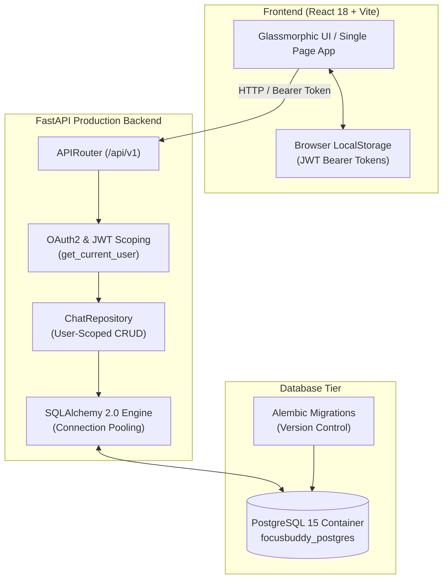

# 📖 Immersed / FocusBuddy — System Architecture & Development Notes

This document serves as a living, comprehensive technical guide and note-taking repository for the **Immersed / FocusBuddy** platform. It documents architectural decisions, technologies used, command reference, and error tracebacks encountered during development.

---

## 📅 System Milestones & Progress Tracker

- [x] **Phase 1: High-Performance Database Migration (SQLite ➔ PostgreSQL & Alembic)**
- [x] **Phase 2: User Authentication & Multi-Tenancy (JWT / OAuth2 & Bcrypt)**
- [x] **Phase 3: Process Management & Abuse Protection (Gunicorn Workers & Redis Rate Limiting)**
- [ ] **Phase 4: Backend API Alignment for Frontend Features (Projects, Knowledge, Tasks)**

- [ ] **Phase 5: Nginx Hardening, TLS & Observability**

---

## 🏛️ System Architecture Overview



### 🧩 Core Architecture & Design Patterns Identified

| Design Pattern | Implementation in Project | Primary Benefit |
| :--- | :--- | :--- |
| **1. Repository Pattern** | `ChatRepository` (`app/db/repository.py`) | Decouples SQL queries and data manipulation from FastAPI endpoints. Allows migrating database engines (SQLite ➔ PostgreSQL) without altering business logic. |
| **2. Strategy Pattern** | Pluggable LLM Provider Factory (`ChatService`) | Standardizes AI model interfaces across multiple providers (`OpenAI`, `OpenRouter`, `Groq`, `Anthropic`, `Mock`) under a single unified execution contract. |
| **3. Dependency Injection Pattern** | FastAPI `Depends` (`get_db`, `get_current_user`) | Dynamically injects database transactions and validated user contexts into route handlers, keeping endpoints lightweight and testable. |
| **4. Master-Worker / Process Supervisor Pattern** | Gunicorn + Uvicorn Workers | Gunicorn manages process health and auto-restart across CPU cores, while Uvicorn workers execute async FastAPI code at maximum performance. |
| **5. Event-Driven Streaming Pattern** | Server-Sent Events (`send_message_stream`) | Streams real-time AI response tokens over HTTP SSE streams (`text/event-stream`), delivering low-latency feedback to the React UI. |
| **6. Layered / N-Tier Architecture** | `Presentation` $\rightarrow$ `API Router` $\rightarrow$ `Service Layer` $\rightarrow$ `Repository` $\rightarrow$ `Database` | Strict separation of concerns ensuring every layer is independently testable, maintainable, and reversible. |

---

### 🛡️ FastAPI Middlewares Used in Project

| Middleware | Implementation Location | Purpose & Function |
| :--- | :--- | :--- |
| **1. CORS Middleware (`CORSMiddleware`)** | Registered in `app/main.py` | Handles Cross-Origin Resource Sharing (`CORS_ORIGINS`). Permits browser frontend (`http://localhost:5173`) to send HTTP headers, OPTIONS preflight checks, and authorization tokens to the backend on port 8000. |
| **2. Rate Limiting Middleware (`slowapi`)** | Initialized in `app/core/limiter.py` & `app/main.py` | Intercepts HTTP requests to protected endpoints, evaluates client IP against Redis (or memory fallback), and enforces rate limits (e.g. `60/minute`), returning `429 Too Many Requests` when limits are exceeded. |
| **3. Custom Exception Middleware** | Registered via `@app.exception_handler` in `app/main.py` | Intercepts application exceptions (`ChatbotException`, `SessionNotFoundException`, `RateLimitExceeded`) and formats standardized JSON error responses. |


---

## 🏗️ Phase 1: Database Migration (SQLite ➔ PostgreSQL & Alembic)

### Why We Built It
- **The SQLite Bottleneck**: SQLite uses single-file locking (`chatbot.db`). Concurrent SSE streaming chat requests from multiple users caused database file locks and timeouts.
- **The PostgreSQL Solution**: Migrating to PostgreSQL enables asynchronous connection pooling (`pool_size=10`, `max_overflow=20`), allowing hundreds of simultaneous concurrent connections.

### Technologies & Drivers
- **PostgreSQL 15 (`postgres:15-alpine`)**: Production database container running inside `docker-compose.yml`.
- **`asyncpg`**: High-performance asynchronous Python PostgreSQL driver.
- **`psycopg2-binary`**: Synchronous Python PostgreSQL driver for SQLAlchemy `SessionLocal`.
- **Alembic**: Database migration framework to track schema changes in revision code files.

### Key Commands Executed
```bash
# Install database drivers and Alembic
pip install psycopg2-binary asyncpg alembic

# Initialize Alembic directory
alembic init alembic

# Generate autogenerated migration script
alembic revision --autogenerate -m "Initial schema setup"

# Sync Alembic version tracking baseline
alembic stamp head
```

---

## 🔒 Phase 2: User Authentication & Multi-Tenancy (JWT + Bcrypt)

### Why We Built It
- **Session Privacy & Multi-Tenancy**: Previously, any user could view all chat sessions. Phase 2 introduces secure user accounts (`users` table) and scopes chat session queries by `user_id`.

### Security Architecture
- **Direct `bcrypt`**: Cryptographic password hashing (`get_password_hash`, `verify_password`). Plaintext passwords are never stored or logged.
- **JSON Web Tokens (JWT)**: Signed tokens created via `python-jose` with `HS256` algorithm and 7-day expiration (`ACCESS_TOKEN_EXPIRE_MINUTES=10080`).
- **FastAPI `OAuth2PasswordBearer`**: Security dependency in `app/api/deps.py` that extracts incoming `Authorization: Bearer <token>` headers and injects current user state into endpoints.

### API Endpoints Added
| Endpoint | Method | Purpose |
| :--- | :--- | :--- |
| `/api/v1/auth/register` | `POST` | User registration (creates user, hashes password) |
| `/api/v1/auth/login` | `POST` | JSON login returning JWT access token |
| `/api/v1/auth/token` | `POST` | OAuth2 form login for Swagger UI |
| `/api/v1/auth/me` | `GET` | Returns authenticated user profile |

---

## ⚡ Phase 3: Process Management & Abuse Protection (Gunicorn & Redis)

### Why We Built It
- **Multi-Core Scaling**: Running `uvicorn` directly limits FastAPI execution to a single CPU core in a single process. Combining **Gunicorn Master Supervisor** with **Uvicorn Workers** (`gunicorn -w 4 -k uvicorn.workers.UvicornWorker`) utilizes all CPU cores and automatically recovers if a worker crashes.
- **Abuse Protection & Rate Limiting**: Integrating containerized **Redis** (`redis:7-alpine`) and **`slowapi`** middleware protects downstream LLM API keys from DDoS traffic, billing spikes, and automated scraping.

### Architecture: Gunicorn Supervisor vs Uvicorn Workers
- **Gunicorn (Master Process)**: Supervises worker process health, distributes incoming requests across CPU cores, and instantly restarts dead worker processes.
- **Uvicorn Workers (`UvicornWorker`)**: Async worker processes executing FastAPI endpoints and SSE streams inside each CPU core at maximum speed.

### Technologies Used
- **`gunicorn`**: Production WSGI/ASGI HTTP process manager.
- **`redis:7-alpine`**: Containerized in-memory data store for rate-limiting counters.
- **`slowapi`**: Rate limiting middleware for FastAPI backends.

### Key Commands Executed
```bash
# Install Gunicorn, SlowAPI, and Redis packages
pip install gunicorn slowapi redis

# Run test suite with rate limiting middleware enabled
python -m pytest
```

---

## 🐛 Error Log & Troubleshooting Archive

### 1. SQLite ALTER Constraint Error
- **Error**: `NotImplementedError: No support for ALTER of constraints in SQLite dialect`
- **Root Cause**: SQLite lacks native SQL support for `ALTER TABLE ADD CONSTRAINT`.
- **Fix**: Added `render_as_batch=True` to `context.configure()` in `backend/alembic/env.py`.

### 2. Alembic Unsynced Revision Error
- **Error**: `FAILED: Target database is not up to date.`
- **Root Cause**: SQLite database had tables created prior to Alembic tracking.
- **Fix**: Executed `alembic stamp head` to align Alembic's `alembic_version` tracker.

### 3. Bcrypt Passlib Password Slicing Error
- **Error**: `ValueError: password cannot be longer than 72 bytes`
- **Root Cause**: Passlib internal probe incompatible with bcrypt v5.0+.
- **Fix**: Replaced Passlib with direct `bcrypt` module (`bcrypt.hashpw` and `bcrypt.checkpw`) with explicit `[:72]` byte slicing.

### 4. Missing Union Type Hint Import
- **Error**: `NameError: name 'Union' is not defined`
- **Root Cause**: Used `Union` annotation in `security.py` without importing `Union` from `typing`.
- **Fix**: Added `from typing import Optional, Any, Union` to `security.py`.

### 5. Redis Connection Error During Local Pytest Execution
- **Error**: `redis.exceptions.ConnectionError: Error 10061 connecting to localhost:6379`
- **Root Cause**: When running `pytest` locally on Windows (where Redis container is not running on localhost:6379), `slowapi` attempting to hit Redis fails.
- **Fix**: Added a lightweight Redis socket ping check in `backend/app/core/limiter.py` that gracefully falls back to `memory://` in-memory rate limiting when Redis is offline.


---

## ❓ Frequently Asked Questions (FAQ) & Notes Area

*(Feel free to add your questions or notes here as we continue building!)*

#### Q1: Why do we keep local SQLite fallback when we have PostgreSQL?
> **Answer**: Local SQLite fallback allows developers and unit tests (`pytest`) to run instantly in milliseconds without needing a running PostgreSQL Docker container.

#### Q2: What happens if a user visits without logging in?
> **Answer**: The `user_id` column on `chat_sessions` is nullable (`nullable=True`), allowing guest/unauthenticated chats to function seamlessly alongside authenticated user accounts.

#### Q3: Why are we using Gunicorn instead of running Uvicorn directly?
> **Answer**: Running Uvicorn alone (`uvicorn app.main:app`) runs inside a single process on a single CPU core. In production, we combine **Gunicorn as the Process Master/Supervisor** with **Uvicorn Workers** (`gunicorn -w 4 -k uvicorn.workers.UvicornWorker`). Gunicorn distributes traffic across all available CPU cores, monitors worker process health, and automatically recovers from crashes, while Uvicorn handles asynchronous FastAPI execution inside each worker at maximum speed.

